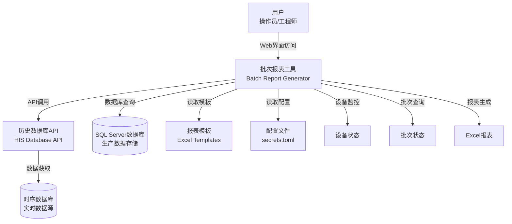
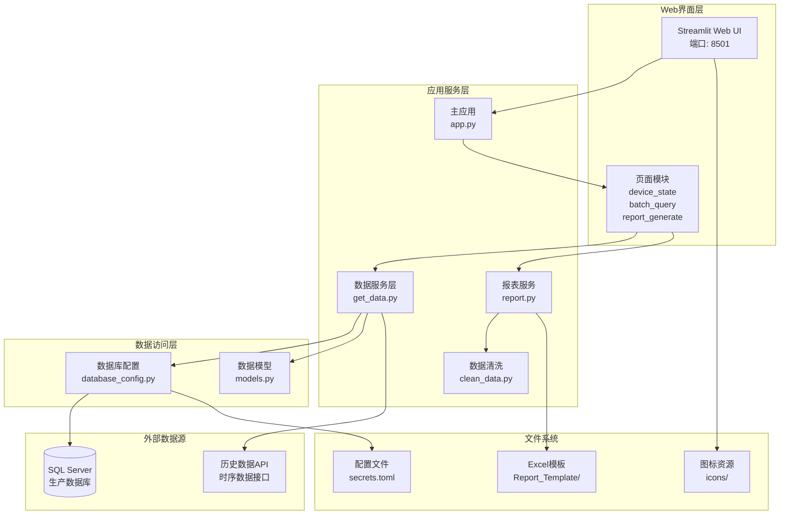
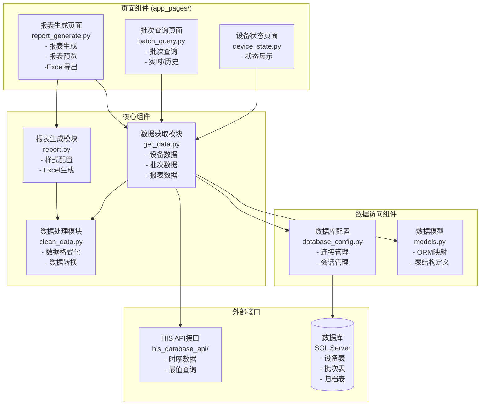
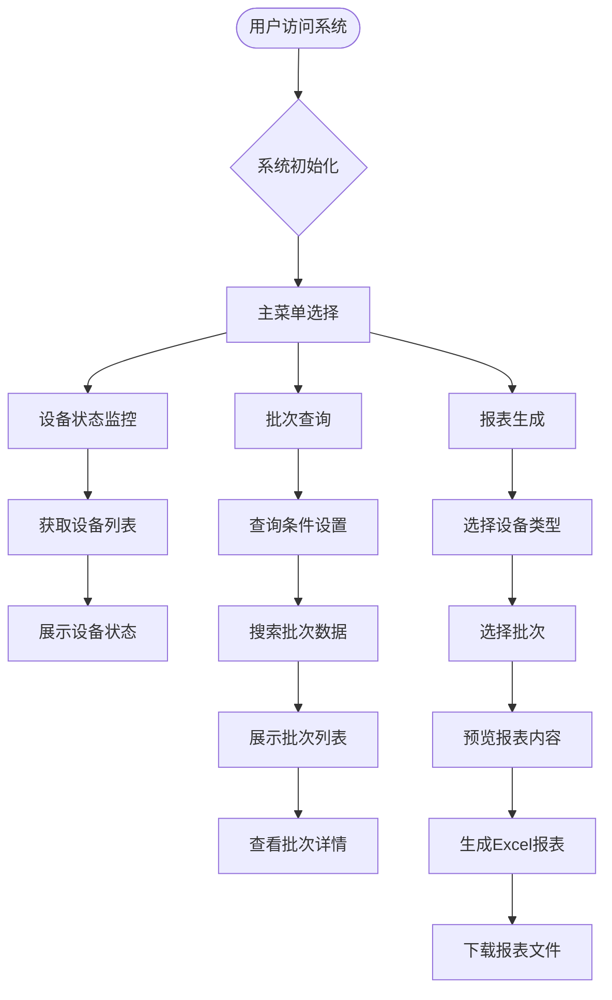
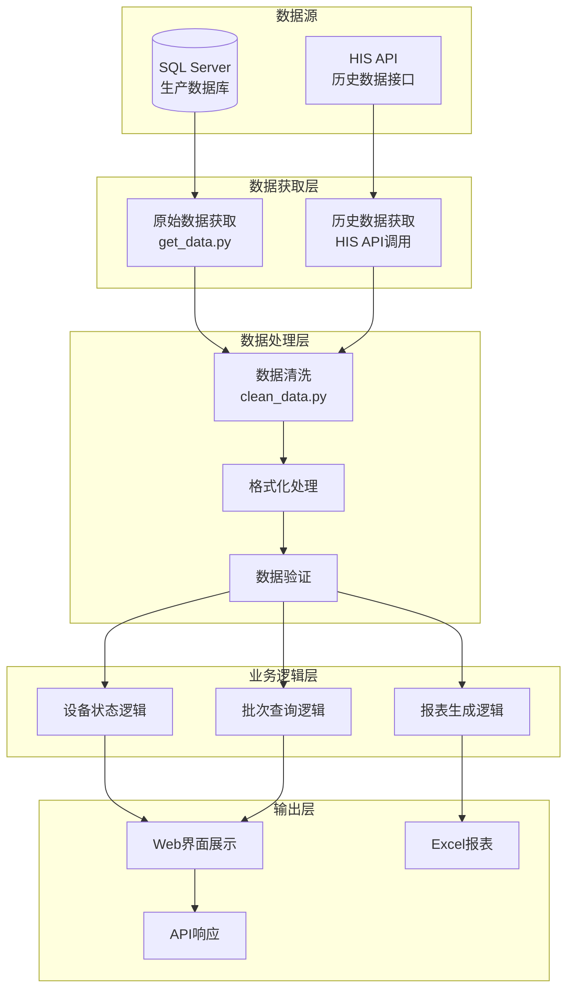
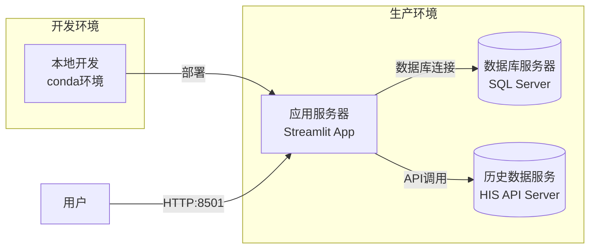

# 批次报表工具

## 系统概述

批次报表工具是一个基于Streamlit的Web应用，用于批次数据管理和报表生成。系统通过SQLAlchemy连接SQL Server数据库，提供设备监控、批次查询和报表生成功能。

### 技术栈

| 模块 | 技术 | 用途 |
|------|------|------|
| 前端界面 | Streamlit | Web UI框架 |
| 数据展示 | st-aggrid, streamlit-antd-components | 数据表格和组件 |
| 后端框架 | Python 3.13 | 核心开发语言 |
| ORM框架 | SQLAlchemy 2.0+ | 数据库访问 |
| 数据库 | SQL Server | 生产数据存储 |
| 数据处理 | Pandas | 数据分析处理 |
| 报表生成 | openpyxl | Excel文件生成 |
| 配置管理 | Streamlit Secrets | 敏感信息管理 |

## 系统架构图

### 整体架构



### 应用架构



### 组件架构



## 数据流程图

### 主要业务流程



### 数据处理流程



## 部署架构



## 扩展预留

<!-- ### 功能扩展点

1. **认证授权模块**: 用户登录和权限管理
2. **数据缓存层**: Redis缓存提升性能
3. **任务调度器**: 定时报表生成
4. **消息通知**: 邮件/微信通知功能
5. **数据可视化**: 图表分析功能
6. **移动端适配**: 响应式设计优化

### 技术架构扩展

```mermaid
flowchart TB
    %% 当前架构 - 实线
    Current[当前单体架构<br/>Streamlit + SQLAlchemy]
    
    %% 扩展架构 - 虚线
    Future1[微服务架构<br/>API Gateway + Services]
    Future2[消息队列<br/>Redis/RabbitMQ]
    Future3[容器化部署<br/>Docker + K8s]
    Future4[监控告警<br/>Prometheus + Grafana]
    
    Current -.->|扩展| Future1
    Current -.->|扩展| Future2
    Current -.->|扩展| Future3
    Current -.->|扩展| Future4
    
    style Future1 stroke-dasharray: 5 5
    style Future2 stroke-dasharray: 5 5
    style Future3 stroke-dasharray: 5 5
    style Future4 stroke-dasharray: 5 5
``` -->
